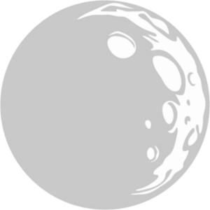

# doc

## Usage 
Pour utiliser cette application il faut avroir les pré-requis suivantes: 

1. Back-end: 
  * Installer [go](https://golang.org/dl/) dans votre machine.
  * Faire une copie du backend `go get -u github.com/devectron/moonlight`.
  * `cd $GOPATH/src/github.com/devectron/moonlight`.
  * `go build` et apres `./moonlight` OU `go run main.go`.
2. Front-end:
  * Faire une copie `git clone https://github.com/devectron/ui`.
  * `cd ui/`.
  * `npm install`.
  * `ng serve`.
  * Et tapez le lien suivant `localhost:4200` dans votre navigateur.

## Le trinomes:
[Nezli Amara](https://github.com/hihebark)

[Ayadi Abderraouf Oussama](https://github.com/Gitouss)

[Khettat Brahim](https://github.com/KhBrahim)
